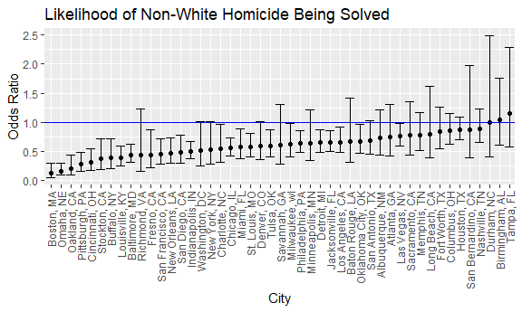
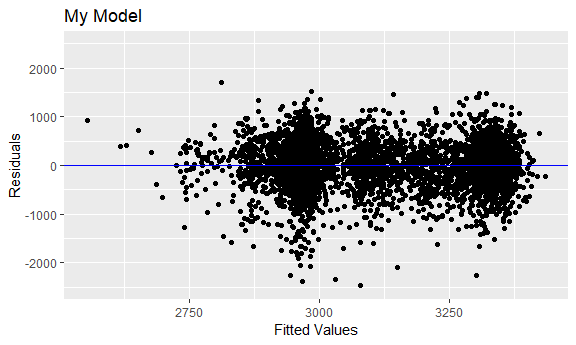
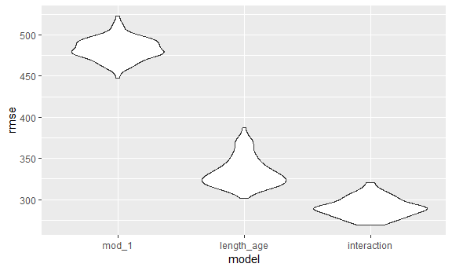

p8105\_hw6\_cj2493
================
Courtney Johnson
November 20, 2018

Problem 1
---------

Read in the homicide data:

``` r
homicides = read_csv("https://raw.githubusercontent.com/washingtonpost/data-homicides/master/homicide-data.csv") 
```

    ## Parsed with column specification:
    ## cols(
    ##   uid = col_character(),
    ##   reported_date = col_integer(),
    ##   victim_last = col_character(),
    ##   victim_first = col_character(),
    ##   victim_race = col_character(),
    ##   victim_age = col_character(),
    ##   victim_sex = col_character(),
    ##   city = col_character(),
    ##   state = col_character(),
    ##   lat = col_double(),
    ##   lon = col_double(),
    ##   disposition = col_character()
    ## )

Clean data accordingly: create city\_state variable, a binary variable denoting whether the case was solved, omit cities who don't report victim race or were the product of a data entry mistake, modify victim race to white and non-white, and make sure victim\_age is numeric.

``` r
homicides = homicides %>%
  janitor::clean_names() %>%
  mutate(city_state = str_c(city, ", ", state),
         victim_age = as.numeric(victim_age),
         victim_race = ifelse(victim_race == "White", c("white"), c("non_white")),
         resolved = as.numeric(disposition == "Closed by arrest")) %>%
  filter(city_state != "Dallas, TX" & city_state != "Phoenix, AZ" & city_state != "Kansas City, MO" & city_state != "Tulsa, AL") %>%
  mutate(victim_sex = factor(victim_sex, levels = c("Male", "Female")),
         victim_race = fct_relevel(victim_race, "white"))
```

    ## Warning in evalq(as.numeric(victim_age), <environment>): NAs introduced by
    ## coercion

For Baltimore, MD, use glm function to fit a logistic regression with resolved vs unresolved as outcome and victim age, sex and race as predictors.

``` r
baltimore_hom = homicides %>%
  filter(city_state == "Baltimore, MD") 
 

balt_logistic = baltimore_hom %>%
  glm(resolved ~ victim_age + victim_sex + victim_race, data = ., family = binomial()) %>%
  broom::tidy() %>%
  mutate(OR = exp(estimate)) %>%
  filter(term == "victim_racenon_white") %>%
  mutate(OR_ci_low = exp(estimate - 1.96*std.error),
         OR_ci_high = exp(estimate + 1.96*std.error)) %>%
  select(term, estimate, starts_with("OR")) %>%
  knitr::kable(digits = 3)
balt_logistic
```

| term                   |  estimate|     OR|  OR\_ci\_low|  OR\_ci\_high|
|:-----------------------|---------:|------:|------------:|-------------:|
| victim\_racenon\_white |     -0.82|  0.441|        0.313|          0.62|

Based on this, when you hold all other variables fixed, non-white victims in Baltimore are 0.44 times as likely to have their homicides solved as white victims. We are 95% confident that the true Odds Ratio lies between 0.31 and 0.62.

Run glm for each of the cities in the dataset and extract the adjusted OR and CI for solving homicides comparing white and non-white victims.

``` r
nest_glm = homicides %>%
  group_by(city_state) %>%
  nest() %>%
  mutate(models = map(data, ~glm(resolved ~ victim_age + victim_sex + victim_race, data = ., family = binomial())),
         models = map(models, broom::tidy)) %>%
  select(-data) %>%
  unnest() %>%
  mutate(OR = exp(estimate)) %>%
  filter(term == "victim_racenon_white") %>%
  mutate(OR_ci_low = exp(estimate - 1.96*std.error),
         OR_ci_high = exp(estimate + 1.96*std.error)) %>%
  select(city_state, term, estimate, starts_with("OR"))
```

Plot the OR's and CI's.

``` r
nest_glm %>%
  mutate(city_state = fct_reorder(city_state, OR)) %>%
  ggplot(aes(x = city_state, y = OR)) +
  geom_point() +
  geom_hline(yintercept = 1.0, color = "blue") +
  geom_errorbar(aes(ymin = OR_ci_low, ymax = OR_ci_high)) +
  theme(axis.text.x = element_text(angle = 90, hjust = 1, vjust = 0.5)) +
  labs(x = "City",
       y = "Odds Ratio",
       title = "Likelihood of Non-White Homicide Being Solved")
```



For most of the cities covered in this dataset, it is less likely for homicides of non-white victims to be solved than those of white victims. The exceptions are Durham, NC, for which reslution is estimated to be equally likely, and Burmingham, AL and Tampa, FL, for which resolution is estimated to be more likely for non-white victims than for white victims. However, about half of the confidence intervals fall on both sides of the 1.0 equality point, so these could merit a little more investigation.

Problem 2
---------

Load and clean birthweight data.

``` r
birthweight = read_csv("./data/birthweight.csv")
```

    ## Parsed with column specification:
    ## cols(
    ##   .default = col_integer(),
    ##   gaweeks = col_double(),
    ##   ppbmi = col_double(),
    ##   smoken = col_double()
    ## )

    ## See spec(...) for full column specifications.

``` r
birthweight = birthweight %>%
  mutate(babysex = as.factor(babysex),
         frace = as.factor(frace),
         malform = as.factor(malform),
         mrace = as.factor(mrace))
birthweight[!complete.cases(birthweight), ] 
```

    ## # A tibble: 0 x 20
    ## # ... with 20 variables: babysex <fct>, bhead <int>, blength <int>,
    ## #   bwt <int>, delwt <int>, fincome <int>, frace <fct>, gaweeks <dbl>,
    ## #   malform <fct>, menarche <int>, mheight <int>, momage <int>,
    ## #   mrace <fct>, parity <int>, pnumlbw <int>, pnumsga <int>, ppbmi <dbl>,
    ## #   ppwt <int>, smoken <dbl>, wtgain <int>

There are 0 observations, so this shows that there are no missing values in the data set.

Propose a regression model for birthweight:

``` r
bwt_model_1 = birthweight %>%
  lm(bwt ~ mrace + fincome + malform + momage + pnumlbw + smoken, data = .) 
```

To come up with my model, I hypothesized what may affect birthweight from prior knowledge. I know that the race of the mother can impact risk for health complications during birth, so I added that to my model. The family income can affect the prenatal care and diet of the mother, so I thought that may have an effect on the health of the baby as well. I know that the older the mother is, the more likely there are to be complications during birth, so I thought that may impact birthweight. I also guessed that number of prior low birth babies would be a good indicator, so I added that to my model. Lastly, I know that mothers who smoke are more likely to have low birthweight babies, so I added that to my model.

``` r
lm_length_age = birthweight %>%
  lm(bwt ~ blength + gaweeks, data = .) 

lm_interaction = birthweight %>%
  lm(bwt ~ bhead + blength + babysex + bhead*blength + bhead*babysex + blength*babysex + bhead*blength*babysex, data = .) 
```

Show a plot of model residuals against fitted values.

``` r
my_mod = birthweight %>%
  modelr::add_predictions(., bwt_model_1) %>%
  modelr::add_residuals(., bwt_model_1) %>%
  ggplot(aes(x = pred, y = resid)) + geom_point() +
  ylim(-2500, 2500) +
  geom_hline(yintercept = 0, color = "blue") +
  labs(x = "Fitted Values",
       y = "Residuals",
       title = "My Model")
```

    ## Warning in predict.lm(model, data): prediction from a rank-deficient fit
    ## may be misleading

    ## Warning in predict.lm(model, data): prediction from a rank-deficient fit
    ## may be misleading

``` r
my_mod 
```



From these, it appears that there are some clusters in the residuals, as opposed to being entirely random. So, already we can see that maybe this is not the best model.

Compare the models.

``` r
cv_df = 
  crossv_mc(birthweight, 100) %>%
  mutate(train = map(train, as_tibble),
         test = map(test, as_tibble))

cv_df = cv_df %>%
  mutate(bwt_model_1    = map(train, ~lm(bwt ~ mrace + fincome + malform + momage + pnumlbw + smoken, data = .)),
         lm_length_age  = map(train, ~lm(bwt ~ blength + gaweeks, data = .)),
         lm_interaction = map(train, ~lm(bwt ~ bhead + blength + babysex + bhead*blength + bhead*babysex + blength*babysex + bhead*blength*babysex, data = .))) %>%
  mutate(rmse_mod_1       = map2_dbl(bwt_model_1, test, ~rmse(model = .x, data = .y)),
         rmse_length_age  = map2_dbl(lm_length_age, test, ~rmse(model = .x, data = .y)),
         rmse_interaction = map2_dbl(lm_interaction, test, ~rmse(model = .x, data = .y)))

cv_df %>%
  select(starts_with("rmse")) %>%
  gather(key = model, value = rmse) %>%
  mutate(model = str_replace(model, "rmse_", ""),
         model = fct_inorder(model)) %>%
  ggplot(aes(x = model, y = rmse)) + geom_violin()
```



From this, we can see definitively that the interaction model has the smallest RMSE for the three models, and is thus the better of the three.
